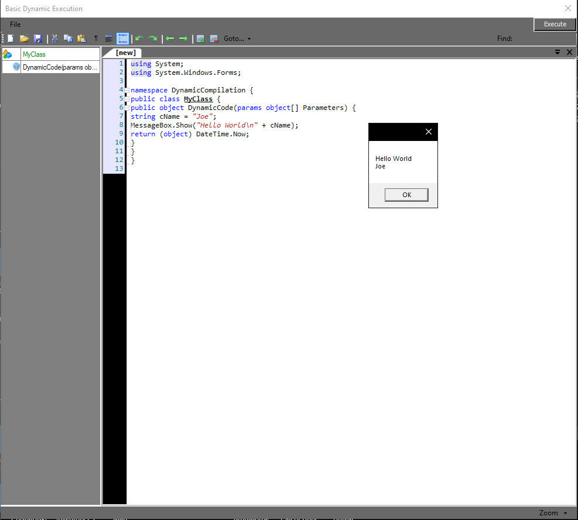

# Dynamic-Executer
Dynamically execute code snippets to test stuff, Pretty simple and straightforward. Hello World sample included.
I did use the Fastcoloredtextbox example for this.
Can be found here : https://github.com/PavelTorgashov/FastColoredTextBox

